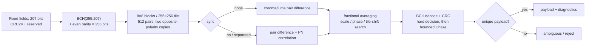

# BlindWatermark

English · [中文](README.md)

A screen-level blind watermark for iOS: an invisible chroma perturbation covers the whole app
window, so **every screenshot carries it**. From a screenshot you can later recover **device,
time and page**, which is what you need to identify who reported a problem.

No screenshot API is hooked. Screenshots are composited by the render server, so the pixels of
the watermark window end up in the output by construction.

- Payload: 512 bit / 64 bytes (layout v4) — uid + Unix seconds + build number + 15-character
  page code + 22-byte note + 96-bit check value
- Version: `2.0.0` ([Releases](https://github.com/zylcold/BlindWatermark/releases); SwiftPM uses
  `from: "2.0.0"`, CocoaPods uses `:tag => '2.0.0'`)
- Invisible (**luma axis only**): luma residual 0.07/255 (below the visibility threshold), chroma
  plane only; the chroma axis swings by `delta` (8/255 at the default 8), so a faint checkerboard is
  still visible on large flat or gradient areas — lower `delta` to make it fainter (table below)
- Survives JPEG: 8×8 px blocks encoded in pairs, flat inside each block; decodes at q=0.6
- Decoding: `swift run bwdecode shot.png --auto --layout --key <hex>`, ~0.1 s for a full-screen shot

---

## Contents

- [Why it is invisible](#why-it-is-invisible)
- [How it works](#how-it-works)
- [Integration](#integration)
- [Parameters](#parameters)
- [Decoding](#decoding)
- [Default payload layout](#default-payload-layout)
- [Measured results and limits](#measured-results-and-limits)
- [Simulator smoke test](#simulator-smoke-test)
- [CI](#ci)
- [Compliance](#compliance)

---

## Why it is invisible

The watermark lives on the **blue–yellow opponent plane**, not on the luma plane.

The luma null direction is `(0.128, 0.128, -1)` (`0.299×0.128 + 0.587×0.128 − 0.114 = 0`).
Two adjacent blocks get `(0,0,a)` and `(p,p,0)` respectively; with `p = round(0.114a/0.886)`
the two colours have **equal luma and differ only in chroma**.

The point is that blending is **linear in premultiplied alpha**: the luma difference of the
composite equals the luma difference of the overlay colours in premultiplied space, so it does
not decay with alpha. `p` therefore has to hit that ratio exactly — at `a=6` rounding yields
`p=0`, i.e. pure black paired with pure blue, a 0.68/255 luma step, and the grid becomes visible.
`a=8, p=1` is the sweet spot with a 0.026/255 residual.

**That 0.026/255 is the luma axis only**: the chroma axis swings by `delta` itself (8/255 at
a=8, about 3% of full scale) as a 2.67 pt checkerboard across the screen, so on large flat or
gradient areas the eye does see a faint blue / pink grid. "Invisible" means luma-invisible, not
chroma-invisible; if the grid bothers you, **lower `delta`** instead of touching the companion `p`.

Measured on an iPhone 16 simulator (plain page, horizontal band with no gradient inside it, so
what is measured is the watermark alone):

| Mode | Luma range | Chroma range |
|---|---|---|
| **chroma, alpha 8 (default)** | **0.07 / 255** | 9.04 |
| luma, alpha 6 | 6.04 / 255 | 0.10 |

Luma moves by 0.03% — essentially nothing. Human acuity for high-frequency chroma is far lower
than for luma (roughly 1/4), so the remaining chroma grid is hard to notice too. That is also why
chroma is the default: the 6/255 luma grid of luma mode is visible up close.

## How it works

- The screen is covered by a tiled **8×8 px block** pattern (tile = 256×256 device pixels), not by
  single-pixel noise — the inside of a block is flat, so JPEG does not smear it away.
- Every two adjacent blocks (A, B) encode 1 bit: `1` → A darker, B brighter; `0` → the opposite.
- Decoding takes `d = mean(A) − mean(B)`. The dark block loses `−base·α`, the bright one gains
  `(255−base)·α`; the `base` terms cancel, so `d ≈ ∓alpha`. **Independent of the background** —
  white, black and dark photos all decode.
- Among the repeated observations of the same bit, **polarity flips every other copy**: the
  watermark component adds up with the same sign while the picture's own luma gradient cancels.
- Reading is not taking a sign: signed differences are accumulated and divided by the standard
  error to get a z value. The watermark grows linearly with the number of observations, content
  noise decays as `1/√n`. One iPhone 16 screenshot gives each bit ~45 observations
  (512-bit layout, 23287 pairs in total).

The decode margin was also measured, not guessed (iPhone 16, 3x, luma mode, 32-bit layout):

| Scheme | Median \|z\| | Weak bits | Verdict |
|---|---|---|---|
| 16px blocks, delta 3 | 1.9 | 27/32 | decoding is luck |
| 8px blocks, delta 3 | 3.3 | 12/32 | still unstable |
| **8px blocks, delta 6 (luma default)** | **6.4** | **0/32** | **reliable** |
| no watermark (control) | 0.5 | 32/32 | no false positives |

Those numbers are for the old 32-bit prototype. The current layout is 512 bit, which **halves the
observations per bit**, so luma is no longer usable at all (see
[Measured results and limits](#measured-results-and-limits)) — the defaults are chroma + delta 8.

## Integration

### Swift Package Manager

```swift
.package(url: "git@github.com:zylcold/BlindWatermark.git", from: "2.0.0")
```

```swift
import BlindWatermark

// The server computes the check value and ships all 64 bytes; the client only renders them
Watermark.install(payload: serverIssuedBytes)

// Deployments without a key (the client builds the payload itself): fill the public self-check
// value so the decoder can validate without any secret. build/note come from the caller
// (CI build number / ticket id) and are optional
Watermark.install(payload: WatermarkPayload.selfChecked(uid: uid, timestamp: ts,
    build: 202609161722, pageClassName: type(of: self).description(),
    note: "hotfix-3", app: 1).bytes)

// Update the page name code on navigation (v4 sets every field at once)
Watermark.update(payload: WatermarkPayload(uid: uid, timestamp: ts, build: build,
    pageClassName: type(of: self).description(), note: note, key: key).bytes)

// The 32-bit convenience entry point still exists
Watermark.install(payload: 0xDEAD_BEEF)
```

The check value lives in the 96-bit `mac` field and has three flavours:

| Constructed with | Field content | Decoder side |
|---|---|---|
| `WatermarkPayload(… key:)` | HMAC-SHA256(first 52 bytes, server key) | with a key → `mac=OK(验签)`; without → `mac=未校验(需要 --key)`, and **crop recovery is unavailable** |
| `WatermarkPayload.selfChecked(…)` | SHA-256(first 52 bytes), truncated | anyone → `mac=OK(自检,未验签)` |
| `mac: []` / all zeros | no check value | `mac=未签名`; cropping search falls back to the structural check |

The self-check catches "alignment was off by a few bits" aliases (measured: zero false positives
over the whole search space) but **cannot stop forgery** (anyone can compute it). Preventing
someone from planting a payload that frames another user requires server-side HMAC.

With nothing configured, a default payload is used (`identifierForVendor` hash + Unix seconds),
so it runs out of the box.

### CocoaPods

Under CocoaPods the three targets ship as three pods (module names match SwiftPM), and **all three
must be declared**: `BlindWatermark` depends on the other two via `s.dependency`, so declaring only
it breaks at `import BlindWatermarkCore`.

```ruby
pod 'BlindWatermarkCore',     :path => '/path/to/BlindWatermark'
pod 'BlindWatermarkAutoLoad', :path => '/path/to/BlindWatermark'
pod 'BlindWatermark',         :path => '/path/to/BlindWatermark'

# Switching to a git source: the repo has tags since 1.0.0
# pod 'BlindWatermarkCore', :git => 'git@github.com:zylcold/BlindWatermark.git', :tag => '2.0.0'
```

Note the podspecs declare `ios.deployment_target = '13.0'` (the repo's platform floor). Xcode 27
only supports 15.0 and above, so building a pod project with it needs the pod targets bumped to
15.0, or an older Xcode.

### Things to watch

- Zero-touch auto loading relies on the object file holding the ObjC `+load` being linked. As long
  as the app does `import BlindWatermark` and calls `Watermark.install` once, that holds. If you
  truly want zero calls, add `-ObjC` to the app target, otherwise static linking drops that file.
- The watermark window uses `windowLevel = .alert + 1` and `isUserInteractionEnabled = false`: it
  does not steal the key window and does not affect the keyboard. The pattern's delta is 8, a
  0.07/255 luma residual — not perceivable.
- **Multi-scene (iPad split view, external display)**: one window per scene, handled.
  A mid-session displayScale change does not repaint the pattern; add a trait observer if you
  really ship external-display support.
- The three parameters **`payloadBits` / `plane` / `delta` must match exactly between encoder and
  decoder**. Put them in the app's configuration, do not rely on memory.

## Parameters

| Parameter | Default | Meaning |
|---|---|---|
| `payload` | — | Payload bytes; bit 0 is the lowest bit of `payload[0]` |
| `payloadBits` | `payload.count × 8` | Number of significant bits, max 512 (a v4 payload is always 512); the decoder must agree |
| `plane` | `chroma` | `chroma` = chroma plane (invisible), `luma` = luma plane (simple but visible) |
| `delta` (named `alpha` in code) | 8 | Perturbation amplitude. \|d\| at the decoder: ≈ delta in luma, ≈ 1.13×delta in chroma. **Minimum 2** |
| `offsetX/offsetY` | 0 | Pattern phase when decoding; only needed for cropped screenshots |
| `windowLevel` | `.alert + 1` | Watermark window level; above system alerts so alert screenshots are traceable |

## Decoding

```bash
swift build -c release
# Parameters known (fastest, 0.08 s)
.build/release/bwdecode shot.png --layout --pages Demo/pages.json --key <hex>

# Cropped shots / unknown plane or bit count (0.1 s, exhaustive search + MAC arbitration)
.build/release/bwdecode shot.png --auto --layout --pages Demo/pages.json --key <hex>

# Plane and bit count known, phase unknown (cropped, never resized)
.build/release/bwdecode shot.png --auto-offset --layout --pages Demo/pages.json --key <hex>

# Print the short code of every class in the registry
.build/release/bwdecode --pages Demo/pages.json --dump-codes
```

The historical bare `--auto` keeps the v4 phase/plane search and HMAC/public-self-check arbitration.
For migration, use the explicit `--protocol auto` spelling to try v5.2 first and then fall back to v4;
v5.2 uses BCH + CRC candidate collection and never accepts the first CRC-valid candidate.

`--auto-offset` is the narrower v4 version: it assumes `--bits` / `--plane` are already correct
(512 / chroma by default) and only searches **the block grid phase (mod 8)**. It additionally
enumerates the 512 tile shifts **only when `--key` is given** (MAC arbitration). It is mutually
exclusive with `--offset` and overlaps `--auto` (passing both exits with an error). Without
`--key` it can only rank by median `|z|` and **does not guarantee a correct payload** — read the
weak-bit count.

Tile shifts must be searched because cropping off a non-multiple of 256 pixels moves the tile
origin relative to the image; every local pair index shifts, which shows up as a **rotation** of
the payload (cropping 137 px → 32 bits of rotation). A phase search only fixes block alignment
(mod 8) and cannot fix that shift: with phase-only search the payload is rotated yet
self-consistent — median `|z|` is high and weak bits are 0/512, it looks perfectly fine and is
simply wrong. **The only reliable arbiter is the check value.**

### Validator ladder

Crop recovery is decided by a **check value** (a wrong shift produces a perfectly self-consistent
payload, so brute force without an arbiter is guessing). The CLI runs three passes:

1. strict validator (HMAC or public self-check) + regular phases
2. strict validator + **block parity** (`ox` in 0..<16) — rescues horizontal crops by an **odd
   number of blocks**
3. structural check as a last resort (only option when the payload carries no check value); it
   prints a warning and does not guarantee a correct payload

Pass 2 fixes a real gap: a pair is two adjacent blocks, so when the block grid is offset by one
block the decoder pairs blocks that straddle two pattern pairs; the reading becomes the sum of two
neighbouring bits (observations survive only where both bits agree) and some bits end up with no
evidence at all. Measured on a text-heavy page cropped by 40 px: the plain phase search cannot find
truth, while with block parity it shows up at `ox=8, rotation=3` and median `|z|` goes from 58.9
back to 67.3 (the same as an even-block crop).

Measured on real pixels (4 pages × 5 crops = 20 cases, no key given):

| Payload | `--auto` without a key |
|---|---|
| carries the public self-check value | **20/20 correct** |
| `mac` all zeros (no check value, structural fallback) | 19/20 (a near-copy slips through) |
| HMAC-signed but no key available | cannot decode (no arbiter) — get the key or have the sender also embed a self-check value |

Horizontal shifts must be taken **modulo per row and column separately** (a shift wraps to column
0 of the same row at the tile's right edge). Adding an offset to the linear index pushes 1/16 of
the observations into the next row; the z values still look great and only the check value catches
it — see `BlockCodecTests.testAutoSurvivesHorizontalCrop`.

The ranking order follows from this: stage one sorts the 16 best-aligned phases by `|z|`, stage two
enumerates shifts on those and checks the check value. Ranking by `signal` would be wrong — it is inflated
by content: a watermark-free luma plane scores 19 while a watermarked chroma plane scores 9, so
it would pick the wrong plane.

```
payload=0xefbeaddefab3ab6afa75722c2f00000013714d0b224d2449922449922449920100686f746669782d33000000000000000000000084c6b56fc6e6ac14ed4f3912  payloadBits=512  平面=chroma  相位=(0,0)  signal=9.00  |z|中位=120.6  最弱=2.9  弱bit=1/512  WEAK(1/512 bit 证据不足，结论谨慎)
uid=3735928559(0xDEADBEEF)  time=2026-09-17 09:33:19 UTC  page=textlist → BHTextListViewController  build=202609161722  note=hotfix-3  layout=v4 app=1 env=0  mac=OK(自检,未验签)
build 时间: 2026-09-16 17:22（构建方当地墙上时间）
```

Read the **weak-bit count** (bits with `|z| < 3`), not the single weakest bit — on real screens the
z value of individual bits collapses naturally and a global minimum is too harsh:

```
OK         weak bits = 0               every bit is significant, conclusion stands
WEAK       weak bits <= payloadBits/8  barely decoded, cross-check the conclusion (= 64 at 512 bits)
NO         more weak bits              there is probably no watermark in the picture
TOO_SMALL  < 5 observations per bit    image too small / pattern destroyed — fields are NOT reported
```

When the verdict says `NO` / `WEAK` but `mac=OK`, **the MAC wins**: weak bits only mean little
margin, not a wrong payload. Conversely `mac=BAD` must be treated as failure — do not read the
numbers anyway.

An image without a watermark measures a median `|z|` of 0.5 and 32/32 weak bits, well separated
from watermarked images.

Agent usage: decoding in [`skills/blind-watermark/SKILL.md`](skills/blind-watermark/SKILL.md),
integration in [`skills/blind-watermark-integration/SKILL.md`](skills/blind-watermark-integration/SKILL.md).

### Python decoder (cross-language backup)

`tools/bwdecode.py` is the same logic in Python: same flags, same output format, same reading rules
as the Swift version. It exists so a screenshot can be decoded **on a machine without Swift**, and
so the two implementations can be cross-checked.

```bash
python3 -m pip install numpy pillow
python3 tools/bwdecode.py shot.png --auto --layout --pages Demo/pages.json --key <hex>

# Cross-check the two implementations on the same PNG (payload / weak bits / fields);
# compares against .build/release/bwdecode when that binary exists
python3 tools/test_bwdecode.py
```

Measured (iPhone 16 screenshot, 1179×2556, M1 Pro): 0.21 s for a normal decode, 0.28 s with
`--auto`. The only dependencies are numpy and Pillow (Pillow reads the image, numpy computes the
feature plane and integral image). It is a mirror: **decoding logic changes must land in both**,
and `tools/test_bwdecode.py` cross-checks them on the same PNG.

## Payload layout (v4)

`WatermarkPayload.byteCount` = 64 bytes / `payloadBits` = 512, all fields little-endian. The doc
comment in `Sources/BlindWatermarkCore/WatermarkPayload.swift` is authoritative; this is a copy:

```
[511:480] uid        32   UInt32   user ID, stored verbatim
[479:448] timestamp  32   UInt32   Unix seconds (screenshot time)
[447:384] build      64   UInt64   build number, 12-digit YYYYMMDDHHMM (e.g. 202609161722); 0 = unset
[383:288] pageCode   96            page class name code, 15 × 6-bit characters = 90 bit (low 6 bits must be 0)
[287:272] tag        16   UInt16   app(8) + environment(8)
[271: 96] note      176            custom note, 22 bytes UTF-8, zero padded
[ 95:  0] check      96            HMAC-SHA256(first 52 bytes, server key) truncated, or SHA-256 (self-check)
```

**There is no version field**: this is the layout, and changing field boundaries means changing the
protocol. **v3 (256 bit / 32 bytes) is deprecated** — historical v3 screenshots do not decode with
this version (see "Known limits").

**Why 512 bit, and what it costs**: observations per bit = image area / pair area / payloadBits, so
**doubling the payload halves the margin**. An iPhone 16 screenshot has 23287 pairs → ~45
observations per bit at 512 bit. Raise `delta` to buy margin back (8 → 10 → 12, measured below);
shrinking blocks to 4 px would restore 183 observations per bit but fails JPEG q80 in practice, so
blocks stay at 8 px.

**At 512 bit each tile holds only one copy**, which disables the "flip every other copy to cancel
content gradients" mechanism. Measured on strong chroma gradients it does not degrade (0/512 weak
bits), and enlarging the tile to 512 px buys little (weak bits 40 → 32), so the geometry stays at
tile 256.

**15-character page code**: `BHUserProfileEditViewController → userprofileedit` fits exactly (the
10-character v3 code truncated it to `userprofil`). The 90 bits used leave 6 bits in the 96-bit field
that must be zero — the structural check verifies them, buying 6 bits of discrimination for free.
Collisions only ever yield 2–3 candidates, resolvable with
`grep -rin "class.*userprofileedit" --include='*.swift'`.

**build and note are supplied by the caller**: build comes from the CI build number (12 digits,
stored and printed verbatim; the decoder also prints a human-readable time), note carries a ticket
id or environment description (≤ 22 bytes UTF-8).

Zero-touch mode (no `Watermark.install`, no `payloadProvider`) builds a v4 payload via
`WatermarkDefaultPayload.currentBytes()`: uid = full 32 bits of `fnv1a(identifierForVendor.uuidString)`,
timestamp = current Unix seconds, build/pageCode/note empty, and the check field holds the **public
self-check value**. The device hash is irreversible; **in production this must be replaced by a
server-issued, signed payload**.

## v5.2 compact protocol (explicit opt-in)

v5.2 is a separate protocol that coexists with layout v4. The default renderer and historical CLI
path stay on v4; use `Watermark.installV52` or `bwdecode --protocol v5.2` to opt in. The protocol packs
207 information bits into BCH(255,207,t6), then adds one even-parity extension bit for a 256-bit
codeword. Each 256 px tile carries two copies with opposite business polarity. BCH corrects up to six
bit errors. A bounded Chase pass tries at most two flips among the twelve least reliable bits, collects
all CRC-valid candidates, deduplicates them, and reports `ambiguous` if different payloads remain.
CRC is an integrity check, not a signature.

### v5.2 scheme breakdown: principles, strengths, and limits

v5.2 is a chain of six layers rather than one “encryption algorithm”: payload packing, error correction,
spatial coding, synchronization, geometry search, and candidate adjudication. Each layer solves a different
problem and has its own failure boundary:



#### 1. Compact payload and field constraints

**Principle.** `uid`, timestamps, page, app id, and a short note are written into fixed-width fields in
207 bits. Page and note use base37; CRC24 covers the first 179 bits and the final four bits are reserved
as zero. Every field is little-endian and fixed-width, so Swift and Python can reconcile bit-for-bit without
sharing an object serialization format.

**Strengths.** The 26-byte message becomes one 256-bit physical codeword, so a 256 px tile can carry two
copies; compared with putting a 512-bit business payload into the same tile, each codeword bit gets more
observation headroom. The fixed fields, profile, and reserved bits also provide cheap structural filtering:
bad alignment is usually rejected before it reaches the business layer.

**Limits.** This is a capacity optimization, not a general metadata container. Page is limited to eight
base37 characters, note to six `[a-z0-9_]` characters, and a trailing `_` cannot be distinguished from padding;
the timestamp and build-time fields also have finite epoch windows. CRC detects accidental corruption but
does not prove that a server issued the payload; use a signature or HMAC at the business layer for
authenticity. If arbitrary UTF-8 text is needed, keep it in a server-side index instead of forcing it into v5.2.

#### 2. BCH(255,207) and the even-parity extension

**Principle.** `V52BCH` performs systematic polynomial division with a fixed GF(256) and generator polynomial,
producing 48 BCH parity bits. The decoder computes syndromes `S1...S12`, derives an error-locator polynomial
with Berlekamp–Massey, finds positions with a Chien search, and flips at most six errors. Bit 256 is an
independent even-parity extension; a final systematic re-encode check rejects a spurious locator.

**Strengths.** The correction rule, bit order, and golden vectors are fixed, and both Swift and Python do it
without a third-party dependency. Up to six hard-decision errors in one 255-bit codeword have a clear BCH
guarantee; a flipped extension parity bit can be repaired separately. CRC is checked after BCH, covering both
channel recovery and field validity.

**Limits.** `t=6` applies to the BCH codeword error model only. Block misalignment, burst errors, clipped colors,
and more than six errors are outside the guarantee. Chase is a bounded reliability heuristic—at most twelve
bits and two flips—not an eight-bit (or higher) BCH guarantee, and it costs additional time. Neither BCH nor
CRC provides confidentiality or authenticity.

#### 3. 8×8 blocks, tiled layout, and opposite-polarity copies

**Principle.** Two adjacent 8×8 blocks form a pair; the sign of their mean difference carries one bit. A
256×256 px tile has 32×16 = 512 pairs. The first 256 pairs carry the original codeword and the second 256
pairs carry the opposite business polarity. The decoder uses `copySign` to fold both copies onto one codeword
index and aggregates observations as z-scores.

**Strengths.** Flat blocks survive light screenshot or JPEG blur better than single-pixel noise. Left-right
differencing cancels the background term, so white, black, and coloured backgrounds are all usable. The second
copy gives each v5.2 codeword bit more observations and allows tile-index shifts to recover a cropped phase;
opposite business polarity also cancels similarly directed content gradients across the two copies.

**Limits.** The 256 px tile and 8 px block are fixed geometry. Small images, non-integer scaling, or heavy
resampling reduce observations; tile-shift search compensates indexing and does not mean that image rotation
is supported. The duplicate copy consumes tile space rather than increasing business capacity, and its errors
are not guaranteed to be independent: occlusion, clipping, or a gradient can affect both copies. Without a
valid CRC/HMAC, a wrong tile shift must be rejected rather than selected because it “looks clean.”

#### 4. `sync=none`, `pn`, and `separated` pilots

**Principle.** `.none` carries only the business difference and is the default baseline. `.pn` adds a
deterministic PN sequence across all 512 pairs. `.separated` uses the same PN index for the two BCH copies,
so pilot correlation can add while business data is recovered by opposite-polarity differencing. The current
implementation writes pilot and data together in a constant-alpha, single-layer RGBA tile and measures
correlation from luma pair differences.

**Strengths.** A pilot uses no payload bits and can expose phase, scale, and signal-quality diagnostics. When
gain is equal and both copies survive, `.separated` gives a more stable correlation signal than a single copy.
It is useful for experiments and tuning without changing the business field protocol.

**Limits.** Adding RGB modulation in the brightness direction leaves measurable luma residual, and pilot
amplitude (about 1–2 in current settings) consumes alpha headroom, reducing data amplitude. Pilot correlation
therefore does not establish visual invisibility. Cropping one copy, unequal resampling gain, colour-space
conversion, JPEG, or camera capture breaks ideal cancellation; `.pn` and `.separated` do not replace manual
P3, sRGB, and OLED visibility review. Production should stay on `.none` unless residuals and acceptance
conditions are recorded separately.

#### 5. Fractional rectangle averaging and uniform-scale search

**Principle.** The decoder builds an integral image for each feature plane and uses rectangle means with
fractional boundaries to model a resized block, instead of rounding the scale to an integer block. `decodeBest`
first ranks a 0.50...1.50 coarse grid at 0.05 steps, then refines local winners while rechecking block phase
and tile-index shifts, and only then enters BCH/CRC decoding.

**Strengths.** The scale need not be a hard-coded whitelist: 0.50, 0.837, 1.173, and 1.50, plus small arbitrary
crop offsets, were recovered under the experiment conditions. Cheap statistics filter geometry contexts before
the bounded 512 tile shifts and Chase budget are spent.

**Limits.** This is a uniform-scale model; it says nothing about rotation, perspective, camera capture, local
crop, or messenger recompression. Resampling kernels, JPEG 4:2:0, P3/sRGB, and device pipelines need separate
measurements. Wider scale ranges and candidate budgets cost time and memory. Current phase search covers integer
pixel positions; subpixel phase remains a later experiment. `estimatedScale` is the best geometric candidate,
not proof of a particular resampler.

#### 6. Candidate collection, CRC adjudication, and `ambiguous`

**Principle.** Hard bits come from the signs of the z-scores. The decoder tries BCH and payload CRC for each
tile index; if hard decisions fail, it enumerates up to two flips among the twelve least reliable bits. Every
CRC-valid result is collected, deduplicated by payload bytes, and represented by its highest-scoring observation.
If more than one distinct payload remains, the result is `ambiguous` rather than the first passing candidate.

**Strengths.** This separates “found a self-consistent result” from “proved the result is unique,” preventing a
wrong phase or a plain image from silently winning by chance. `candidateCount`, `correctedBits`,
`softRecovery`, `scale`, and `phase` also show how much recovery was needed.

**Limits.** CRC false positives are unlikely but not mathematically impossible, and z-scores are not calibrated
error probabilities. Rejecting an ambiguous set is correct but lowers recall. Scores are for ranking, not for
confidence or signature verification. For an answer to “who issued this watermark,” the payload needs a
server-verifiable signature reference or a server-side check of uid, time, and page.

For deployment, keep existing v4 screenshots on the default v4 path. Use v5.2 `.none` for new integrations that
need a compact payload and uniform-resize tolerance. Run `.pn` / `.separated` separately when measuring sync
quality and record their residuals. Use `--protocol auto` only for migration-time mixed detection; the historical
bare `--auto` remains v4 search and is not a cross-protocol probe.

The 207-bit field order is (low bit first):

| Field | Bits | Rule |
| --- | ---: | --- |
| profile | 4 | fixed `1`; unknown values are rejected |
| uid | 32 | `UInt32` |
| timestamp | 31 | seconds after UTC 2026-01-01 |
| buildTime | 24 | minutes after UTC 2026-01-01 |
| page | 42 | eight base37 characters |
| app | 14 | `0...9999` |
| note | 32 | six base37 characters |
| CRC24 | 24 | `poly=0x864CFB, init=0xB704CE, refin=false, refout=false, xorout=0`; covers the first 179 bits |
| reserved | 4 | fixed zero, outside the CRC, non-zero is rejected |

The base37 alphabet is `abcdefghijklmnopqrstuvwxyz0123456789_`; the first character is the most
significant radix digit. Fixed fields are right-padded with `_`, which is removed on decode, so a literal
trailing underscore is not representable. Page names use the existing `PageNameCodec` normalization and
keep eight characters. Notes accept only `[a-z0-9_]` and at most six characters; they are not arbitrary
UTF-8 text. Golden vectors are kept in `Tests/BlindWatermarkCoreTests/V52Tests.swift`:

```text
payload = 8167452371682d01a0dd0a50ffa86faf4a0520236ff49078f702
bch256  = dbf79d8bb6998167452371682d01a0dd0a50ffa86faf4a0520236ff49078f782
```

The canonical BCH vector for `message=1` is
`973cdf85ebc70100000000000000000000000000000000000000000000000080`, using
`generator=0x1c7eb85df3c97`.

```swift
let payload = WatermarkPayloadV52(
    uid: uid, timestamp: UInt64(Date().timeIntervalSince1970),
    buildTime: UInt64(Date().timeIntervalSince1970),
    pageClassName: "BHProfileViewController", app: 42, note: "hotfix"
)!
Watermark.installV52(payload: payload, delta: 4, plane: .chroma)   // v5.2 defaults to delta 4
// On navigation: Watermark.updateV52(payload: nextPayload)
```

The first v5.2 CLI line reports `protocol`, `correctedBits`, `softRecovery`, `scale`, `phase`,
`pilotScore`, `candidateCount`, the evidence fields `minObs` / `avgObs` / `|z| median`, and an
`OK(...)` / `TOO_SMALL(...)` verdict; with `--layout`, the second line adds compact fields and
`crcStatus=OK(完整性自检,未验签)`. v5.2 has no HMAC: CRC24 is an integrity self-check only, the wording
never says `mac=`, and the evidence floor has no "signed payload exception" — below 5 observations per
bit the decoder prints `TOO_SMALL` and **refuses `--layout`** (same bar as v4). The historical bare
`--auto` keeps its v4 phase/plane search. For migration, opt in to
mixed detection with `--protocol auto` (v5.2 first, then v4); use `--protocol v4` to force the historical
protocol. v5.2 rejects v4 `--bits`, `--key`, `--pages`, and `--dump-codes`: it has no HMAC and its
eight-character compact page code cannot be looked up by the v4 fifteen-character registry; negative
`--offset` is rejected too (the decoder searches phases 0...block itself, matching the Python mirror).

`V52SyncMode.pn` and `.separated` are pilot experiment modes; `.none` is the default. The pilot only
affects `--plane chroma`: the luma plane spends the whole brightness channel on data, so no pilot is
written there, `pilotScore` is meaningless, and the CLI warns about it. The pilot adds a small
left/right brightness-direction modulation to a constant-alpha, single-layer tile for correlation
measurement. The experiment leaves measurable luma residual and has no manual P3/sRGB/OLED visibility
approval. `payloadProvider` only serves the zero-touch v4 default payload: v5.2 payloads come from
`installV52` / `updateV52`, their timestamp is frozen at install time, and a fresh timestamp needs
another `updateV52` call. Chroma data and pilot are generated jointly; delta is a premultiplied-alpha RGBA source-layer
amplitude, not a simple chroma addition.

The resize path uses fractional rectangle averaging. Automatic search covers a continuous 0.50...1.50
coarse grid at 0.05 steps, then refines finalists until the step is no larger than
`0.5 / max(width,height)`, rechecking the local phase. Ratios such as 0.837 and 1.173 are deliberately
outside the coarse grid and are experimental coverage, not a guarantee for every image or resampler.
Only uniform scale is covered; rotation, perspective, camera capture, and messenger recompression remain
out of scope.

Reproducible first-pass measurements (Swift 6.3.3, macOS Command Line Tools, `swift build -c release`
(the same search is about 20× slower in a debug build, so do not compare debug timings), 640×900
synthetic grey background, chroma, alpha=8, tiled PNG; timing includes the stated search):

| Path | Condition | Result |
| --- | --- | --- |
| baseline | phase=(3,5), `sync=none`, tile-shift search | payload equal, `correctedBits=0`, one candidate |
| pilot | `.pn` / `.separated` under the same conditions | payload equal; both pilot scores about 0.995 (diagnostic only) |
| resize | nearest-generated 0.50 / 0.837 / 1.173 / 1.50 images with scale supplied | 4/4 payloads equal |
| unlisted-scale search | 0.837, `--protocol v5.2 --auto` coarse grid plus local refinement | release about 0.66 s (debug 11.7 s), estimated scale 0.8358, payload equal |
| full-screen search | 1179×2556, `--protocol v5.2 --auto` | 3.9 s in release, payload equal |
| evidence floor | 320×320 small image (`minObs=2`/bit) | `TOO_SMALL`, `--layout` refused (exit 1 in both implementations) |
| crop | 9 px left and 13 px top, unknown phase/tile shift | payload equal, one candidate |
| negative | 640×900 plain image | no CRC-valid candidate |
| simulator E2E | 1179×2556 iPhone 16 (iOS 18.6) simulator screenshot, six Demo layouts, `--protocol v5.2 --auto` | 6/6 payloads equal, `correctedBits=0`, `candidateCount=1`, 76 minimum observations/bit |
| simulator crop | same screenshot minus 24 px left / 137 px top | payload equal, phase=(8,7) |
| simulator floor | 300×300 crop of the same screenshot | `TOO_SMALL`, `--layout` refused (exit 1) |

#### Visibility versus delta (iPhone 16 simulator / iOS 18.6, 1179×2556, flat gradient page)

Pixels are classified as dark / light from the decoded payload, then the on-screen colour difference
is measured directly. The chroma amplitude equals `delta`; the luma axis is cancelled by the companion
colour (`p = round(0.114·delta/0.886)`, which rounds to 1 anywhere in 2...8):

| delta | ΔR / ΔG | ΔB | ΔLuma | v5.2, six layouts | \|z\| median (worst page: photo) |
| --- | --- | --- | --- | --- | --- |
| 8 (old default) | +1 | −8/255 | 0.35/255 | 6/6, `correctedBits=0` | 42 |
| 6 | +1 | −6/255 | 0.50/255 | 6/6, `correctedBits=0` | 28 |
| **4 (v5.2 default)** | **+1** | **−4/255** | **0.64/255** | **6/6, `correctedBits=0`** | **14** |
| 2 | +1 | −2/255 | 0.78/255 | 6/6, `correctedBits=0` | 36 |

Observation counts are geometry, not amplitude (all six pages report `minObs=76`); the `|z|` median also
depends on the page content and the payload pattern of that run, so the photo page landed anywhere
between 14 and 42 across four runs — treat the column as a margin indicator, not a monotone curve.

v4 for comparison (same page, same delta 8, same palette: ΔB=−8/255): v4 spends twice the observations
per bit, so its six layouts still report `mac=OK(验签)` at delta=6, while delta=4 pushes the dark/mixed
pages to 19/512 weak bits. That is why **v5.2 defaults to 4** while **v4 keeps its historical default
8** (use 6 when you want a fainter grid, after re-checking on a device). Any delta change needs the
device + darkest-page visibility pass from the integration skill.

These are synthetic PNG protocol/geometry measurements. They do not establish device, JPEG, P3/sRGB,
OLED-visibility, or messenger acceptance; the Demo and manual visibility pass still require Xcode and a
device.

## Measured results and limits

### Unit tests

`swift test` covers 59 cases (runs on macOS, no simulator needed): pure white / pure black / mid
grey backgrounds, gradients plus photo-level detail, JPEG q=0.8 and q=0.6, partial cropping
(vertical, horizontal, odd-block offsets), the `delta = 2` floor, no false positives on
watermark-free images, tile geometry contracts, decodability of both chroma and luma, adversarial
chroma textures not silently decoding wrong, `--auto` phase / plane / bit-count detection, the
256-bit layout round-trip with all three check tiers (HMAC / public self-check / unsigned),
near-copy aliases being rejected by the self-check but not by the structural check, block parity
restoring `|z|` for odd-block crops, `findBestOffset` (arbiter-driven) and
PageRegistry / PageNameCodec.

`python3 tools/test_bwdecode.py` adds 115 checks and cross-checks against the Swift binary on the
same PNG.

### Per-page simulator measurements

Six very different layouts in `Demo/`, iPhone 16 simulator (iOS 18.6, 1179×2556), layout v4 payload
(uid `0xDEADBEEF` + time + build `202609161722` + 15-character code + note), chroma at delta 8
(default), no key (the check field holds the public self-check value):

| Page | Content | signal | median \|z\| | weakest | weak bits | Verdict | Check |
|---|---|---|---|---|---|---|---|
| plain | near-flat gradient | 9.00 | 120.3 | 4.1 | 0/512 | OK | self-check |
| white | white + a bit of bubble text | 9.00 | 113.8 | 4.7 | 0/512 | OK | self-check |
| text | text-dense list | 9.00 | 120.6 | 2.9 | 1/512 | WEAK | self-check |
| photo | photo grid (synthetic noise + hard edges) | 9.10 | 35.0 | 6.6 | 0/512 | OK | self-check |
| dark | dark background + dark cards | 9.12 | 113.8 | 1.9 | 4/512 | WEAK | self-check |
| mixed | white over black + text + a photo | 9.21 | 54.9 | 2.1 | 4/512 | WEAK | self-check |

Compared with the 256-bit layout on the same pages: median `|z|` 161.0 → 120.3, weakest 6.7 → 2.9 —
**the margin is roughly halved** (twice the payload = half the observations per bit). The WEAK
verdicts above merely mean "not zero weak bits"; they are far from the 512/8 = 64 threshold, and
`mac=OK(自检,未验签)` already proves the payload is correct. **At 512 bit, judge by the check value;
weak bits only tell you about margin.**

Harshest realistic content (springboard photo wallpaper + icons, composited offline on real pixels):

| delta | observations/bit | decoded | median \|z\| | weak bits |
|---|---|---|---|---|
| 8 (default) | 45.5 | OK | 9.4 | 32/512 |
| 10 | 45.5 | OK | 14.9 | 22/512 |
| 12 | 45.5 | OK | 19.3 | 9/512 |

**luma is unusable at 512 bit** (at delta 12: plain 10/512 WEAK, text 139/512 NO, photo 103/512 NO;
lower delta is worse). luma needs a smaller payload, and re-measurement with `Demo/sweep.sh` first.

> A large `signal` means large content noise and says nothing about decodability (the luma text
> page scores 20 yet is the worst). What decides is `|z|` and the check value.

Verdicts versus the check value: when the verdict says `NO` / `WEAK` but `mac=OK(…)`, **the check
value wins** — weak bits only mean little margin, not a wrong payload. Conversely a payload that
carries a check value and fails it (`mac=BAD`) must be treated as a failure; do not read the
numbers anyway.

The `mac` field is reported in tiers (end of the second `--layout` line):

| Output | Meaning |
|---|---|
| `mac=OK(验签)` | HMAC verified — account/time trustworthy and unforged |
| `mac=OK(自检,未验签)` | public self-check passed — proves "decoded correctly", **not** "not forged" |
| `mac=未签名(字段自洽,退结构自检)` | payload carries no check value; crop conclusions unreliable |
| `mac=未校验(需要 --key)` | HMAC-signed payload but no key given — such a payload **cannot** be searched for crop/rotation (no arbiter); get the key, or have the sender embed the public self-check value |
| `mac=BAD(密钥不符或载荷被改)` | key given and neither check matches |

When validating an integration with different layouts, run `Demo/sweep.sh` and re-measure instead
of copying these numbers:

```bash
cd Demo && ./sweep.sh                          # chroma sweep over all pages (default)
cd Demo && ./sweep.sh "<UDID>" 4 luma          # switch plane / find the margin at a given delta
cd Demo && ./sweep.sh "" "" chroma v52         # sweep the v5.2 protocol (BW_PROTOCOL=v52 + --protocol v5.2 --auto)
```

### Known limits

- **Small crops cannot be decoded, and the decoder refuses to answer**: observations per bit =
  available pairs / payloadBits. Measured (real pixels, chroma, 512 bit, full width 1179): at 4.4
  observations per bit there are 16/512 weak bits and the self-check fails; at 5.3 it passes — so the
  floor is **5 observations per bit**, about **2700 pairs** (≈300 px tall at full width, or a full
  1179×2556 screen). Below that the decoder prints `TOO_SMALL(...)` and **refuses to interpret fields
  with --layout** (degrading to "looks fine but is garbage" is not allowed) — a 482×440 crop measures
  1.5–3.2 observations per bit and is always refused.
- **v5.2 uses the same bar, with no exception**: the 256-bit codeword (two opposite-polarity copies per
  tile, folded back onto the codeword bits) measured **2 observations/bit** on a 320×320 image and
  **90.9 average / 76 minimum** on a real 1179×2556 simulator screenshot; the floor is again
  **5 observations per bit**, about **1280 pairs** (≈150 px tall at full width). CRC24 is an integrity
  self-check, not a signature, so v5.2 has **no** "payload carries a check value, so observations do not
  matter" exception: below the floor it prints `TOO_SMALL(...)` and refuses `--layout` (exit 1).
- **layout v3 (256 bit / 32 bytes) is deprecated**: field boundaries changed, so historical v3
  screenshots no longer decode — an explicit breaking change. To read older images, use the decoder
  from the 1.0.0 tag.

- **Chroma adversarial samples**: a scene whose chroma structure happens to sit at the 8 px scale
  degrades. `testChromaNeverSilentlyWrongOnAdversarialColorTexture` holds the line — such cases
  must fail to decode or report low confidence; silently returning a wrong payload is not allowed.
- **Resizing breaks v4**: a resized v4 screenshot (chat app forwarding, any resize) changes both the
  block size and the tiling period, so nothing decodes. For a uniform resize, try v5.2 with `--scale`
  or `--protocol v5.2 --auto`; that path does not cover unknown messenger recompression.
- **Photographing the screen does not work**: moiré and geometric distortion wreck the block grid;
  that path needs a sync template plus deep learning and is out of scope here.
- **Cropping does work**: `--auto` covers vertical and horizontal crops (including half-pair and
  odd-block offsets). The arbiter is the check value: pass `--key` for a server HMAC, or rely on
  the payload's public self-check value. With neither (`mac` all zeros) it falls back to the
  structural check — measured 19/20 on the 20-case real-pixel sweep, and the one miss looks like a
  plausible answer.

## Simulator smoke test

```bash
cd Demo && xcodegen generate
xcodebuild -project Demo.xcodeproj -scheme Demo \
  -destination 'id=<simulator UDID>' -derivedDataPath /tmp/bwdd build
xcrun simctl install booted /tmp/bwdd/Build/Products/Debug-iphonesimulator/Demo.app
xcrun simctl launch booted com.zylcold.blindwatermark.demo
xcrun simctl io booted screenshot /tmp/shot.png
.build/release/bwdecode /tmp/shot.png
```

Tuning knobs via environment variables (prefix with `SIMCTL_CHILD_` for `xcrun simctl launch`):
`SIMCTL_CHILD_BW_PAYLOAD=0x1234 SIMCTL_CHILD_BW_DELTA=8 SIMCTL_CHILD_BW_PLANE=chroma`.

## CI

`.github/workflows/ci.yml` runs four things on every PR:

1. `swift build` (all targets compile)
2. `swift test` (59 core test cases)
3. `xcodegen generate` + `xcodebuild -destination 'generic/platform=iOS Simulator'` building
   `Demo/`, which covers iOS-side compilation (the UIKit window layer, the ObjC `+load`) that
   `swift test` cannot reach on macOS.
4. `python3 tools/test_bwdecode.py`: Python decoder self-check (v4/v5.2 synthetic round trip,
   cropping, resizing, tamper detection, page codes; 115 checks) cross-checked against the Swift
   `bwdecode` on the same PNG.

Reproduce locally:

```bash
swift build && swift test
python3 tools/test_bwdecode.py
cd Demo && xcodegen generate && xcodebuild -project Demo.xcodeproj -scheme Demo \
  -destination 'generic/platform=iOS Simulator' -derivedDataPath /tmp/bwdd CODE_SIGNING_ALLOWED=NO build
```

## Compliance

The watermark carries device and time information, which is personal data. Privacy policies must
state its purpose and scope, and it must not be used for tracking beyond that purpose. Being
technically possible is not the same as being lawful.

## License

MIT
