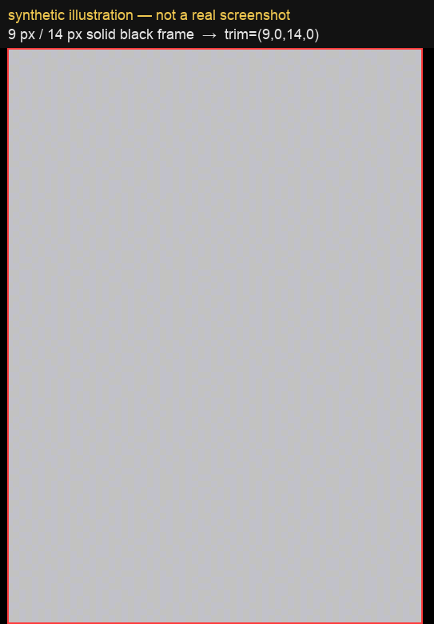
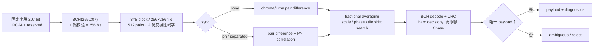
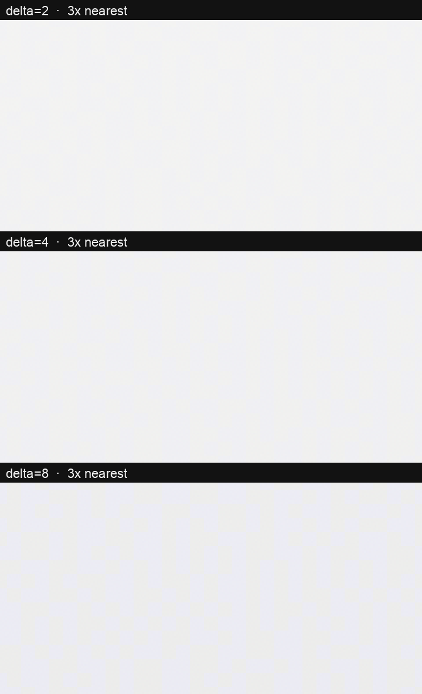
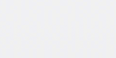
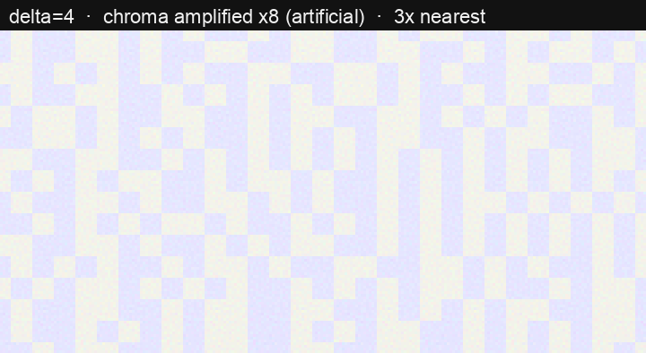

# BlindWatermark

[English](README.en.md) · 中文

iOS 屏上盲水印：整个 App 界面常驻一层肉眼不可见的色度扰动，截图必然被带上，
事后从截图反查出**设备、时间、页面**，用于定位用户上报的问题。

不 hook 截屏 API。截图走 render server 合成，水印窗口的像素天然进产物。

- 载体：512 bit / 64 字节（layout v4），uid + Unix 秒 + build 号 + 15 字符页面短码 + 22 字节 note + 96 bit 校验值
- 版本：`2.1.0`（[Releases](https://github.com/zylcold/BlindWatermark/releases)；SPM 用 `from: "2.1.0"`，CocoaPods 用 `:tag => '2.1.0'`）
- 不可见（**只指亮度轴**）：亮度残差 0.07/255（人眼阈值之下），只压色度平面；色度轴极差 = `delta`，
  默认 8 → 8/255，大块纯色 / 渐变页上仍能看见淡色棋盘格，要更淡就减 delta（见下文实测表）
- 抗压缩：8×8 像素块成对差分，块内平坦，JPEG q=0.6 仍可解
- 解码：`swift run bwdecode shot.png --auto --layout --key <hex>`，整屏截图 0.1 秒

---

## 目录

- [为什么看不见](#为什么看不见)
- [原理](#原理)
- [接入](#接入)
- [参数](#参数)
- [解码](#解码)
- [默认 payload 布局](#默认-payload-布局)
- [实测与边界](#实测与边界)
- [模拟器冒烟](#模拟器冒烟)
- [CI](#ci)
- [合规](#合规)

---

## 为什么看不见

水印压在**蓝-黄对色平面**上，不是亮度平面上。

亮度零方向的向量是 `(0.128, 0.128, -1)`（`0.299×0.128 + 0.587×0.128 − 0.114 = 0`）。
一对相邻块分别叠 `(0,0,a)` 与 `(p,p,0)`，取 `p = round(0.114a/0.886)` 就得到**等亮度、只差色度**的一对色。

关键在混色是**预乘 alpha 的线性运算**：合成分的亮度差等于叠加色在预乘空间的亮度差，不随 alpha 衰减。
所以 `p` 必须精确到这个比例 —— `a=6` 时取整会得 `p=0`，等于拿纯黑去配纯蓝，亮度差 0.68/255，网格立刻显形。
`a=8, p=1` 这组最好，残差 0.026/255。

**但 0.026/255 只是亮度轴**：色度轴的极差就等于 `delta`（a=8 → 8/255，约 3% 满量程），
以 2.67pt 的棋盘格铺满整屏 —— 大块纯色或渐变区域上肉眼就是能看出淡蓝 / 淡粉的格子。
「不可见」指的是亮度轴，不是色度轴；嫌格子明显就**减 delta**，别去动陪色 `p`。

实测（iPhone 16 模拟器，plain 页水平条带，条带内背景无渐变，量到的是纯水印）：

| 模式 | 亮度极差 | 色度极差 |
|---|---|---|
| **chroma，alpha 8（默认）** | **0.07 / 255** | 9.04 |
| luma，alpha 6 | 6.04 / 255 | 0.10 |

亮度只动了 0.03%，等于没动。人眼对高频色度的分辨力也远低于亮度（色度锐度约为亮度的 1/4），
所以剩下的那点色度网格同样难以察觉 —— 这也是默认走 chroma 的原因：luma 模式的 6/255 亮度网格凑近看得见。

## 原理

- 覆盖全屏的是 **8×8 像素块**平铺图案（tile 256×256 设备像素），不是单像素噪点 —— 块内平坦，过 JPEG 不会被抹掉。
- 每两个相邻块 (A, B) 编码 1 bit：`1` → A 压暗 B 提亮；`0` → A 提亮 B 压暗。
- 解码取 `d = mean(A) − mean(B)`：压暗块的减益是 `−base·α`，提亮块的增益是 `(255−base)·α`，
  两者相加把 `base` 抵消 → `d ≈ ∓alpha`。**与底色无关**，白底、黑底、深色照片都能解。
- 同一个 bit 的多份重复观测里**隔一份翻转极性**：水印分量同向累加，画面自身的亮度梯度正负相消。
- 读码不是取符号，而是按带符号差值累加后除以标准误得到 z 值：水印随观测次数线性累加，
  内容噪声按 `1/√n` 衰减。一张 iPhone 16 截图每 bit 有约 45 次观测（512 bit 布局，共 23287 个 pair）。

解码余量也是模拟器实测定的（iPhone 16，3x，luma 模式，32 bit 布局）：

| 方案 | \|z\| 中位 | 弱 bit | 结论 |
|---|---|---|---|
| 16px 块，delta 3 | 1.9 | 27/32 | 解出来是运气 |
| 8px 块，delta 3 | 3.3 | 12/32 | 仍不稳 |
| **8px 块，delta 6（luma 默认）** | **6.4** | **0/32** | **可靠** |
| 无水印对照 | 0.5 | 32/32 | 不误报 |

上表是 32 bit 布局下的结论。**256 bit 布局把每个 bit 的观测数摊薄到 1/8，luma 模式不再够用**
（实测见[实测与边界](#实测与边界)），所以默认参数是 chroma + delta 8。

## 接入

### Swift Package Manager

```swift
.package(url: "git@github.com:zylcold/BlindWatermark.git", from: "2.1.0")
```

```swift
import BlindWatermark

// 服务端算好校验值下发完整 64 字节，客户端只管渲染
Watermark.install(payload: serverIssuedBytes)

// 没密钥的部署（客户端自己拼载荷）：填公开自检值，解码端没有密钥也能校验
// build / note 由外部传入（CI 打包号 / 工单号），都是可选的
Watermark.install(payload: WatermarkPayload.selfChecked(uid: uid, timestamp: ts,
    build: 202609161722, pageClassName: type(of: self).description(),
    note: "hotfix-3", app: 1).bytes)

// 换页时更新页面短码（v4 一次性 set 全部字段）
Watermark.update(payload: WatermarkPayload(uid: uid, timestamp: ts, build: build,
    pageClassName: type(of: self).description(), note: note, key: key).bytes)

// 32 bit 便捷入口仍在
Watermark.install(payload: 0xDEAD_BEEF)
```

校验值有两档，都在同一个 `mac` 字段（96 bit）里：

| 构造方式 | 字段内容 | 解码端 |
|---|---|---|
| `WatermarkPayload(… key:)` | HMAC-SHA256(前 52 字节, 服务端密钥) | 有密钥 → `mac=OK(验签)`；没密钥 → `mac=未校验(需要 --key)`，**裁剪自愈用不了** |
| `WatermarkPayload.selfChecked(…)` | SHA-256(前 52 字节) 截断 | 任何人 → `mac=OK(自检,未验签)` |
| `mac: []` / mac 全 0 | 没有校验值 | `mac=未签名`，裁剪/相位搜索只能退结构自检 |

自检值能拦住"对齐错了几 bit"的近似解（实测全搜索空间假阳性 0），但**拦不住伪造**（谁都能算）；
要防伪造（防止有人埋一个栽赃别人的载荷）必须用服务端 HMAC。

未设置任何东西时用默认 payload（`identifierForVendor` 哈希 + Unix 秒），开箱可跑。

### CocoaPods

CocoaPods 下三个 target 拆成三个 pod（模块名与 SPM 一致），**必须一起声明**：
`BlindWatermark` 通过 `s.dependency` 依赖另外两个，只写它会在 `import BlindWatermarkCore` 处挂掉。

```ruby
pod 'BlindWatermarkCore',     :path => '/path/to/BlindWatermark'
pod 'BlindWatermarkAutoLoad', :path => '/path/to/BlindWatermark'
pod 'BlindWatermark',         :path => '/path/to/BlindWatermark'

# 换成 git 源：仓库有 tag（1.0.0 起）
# pod 'BlindWatermarkCore', :git => 'git@github.com:zylcold/BlindWatermark.git', :tag => '2.1.0'
```

注意 podspec 声明 `ios.deployment_target = '13.0'`（仓库平台下限）。Xcode 27 起最低只支持 15.0，
用它建 pod 工程需要把 pod target 的部署目标抬到 15.0，或改用较老的 Xcode。

### 接入注意

- 零代码自动加载依赖 ObjC `+load` 所在目标文件被链接。只要 App 里 `import BlindWatermark`
  并调用过一次 `Watermark.install`，链接就成立。若确实要完全零调用，App target 需要加
  `-ObjC`，否则静态链接会把那个目标文件丢掉。
- 水印窗口 `windowLevel = .alert + 1`、`isUserInteractionEnabled = false`，不抢 key window，
  不影响输入法。图案 delta 8，亮度残差 0.07/255，视觉上察觉不到。
- **多 scene（iPad 分屏、外接屏）**：每个 scene 各挂一个窗口，已处理。
  displayScale 中途变化（插拔外接屏）不会重画图案，真接了外接屏再监听 trait 变化。
- 三个参数 **`payloadBits` / `plane` / `delta`，解码端必须与接入端完全一致**。写进 App 的配置，别靠记忆。

## 参数

| 参数 | 默认 | 说明 |
|---|---|---|
| `payload` | — | 载荷字节，bit 0 在 payload[0] 最低位 |
| `payloadBits` | `payload.count × 8` | 有效位数，上限 512（v4 载荷固定 512），解码端必须一致 |
| `plane` | `chroma` | `chroma` 压色度平面（不可见），`luma` 压亮度平面（简单但看得见） |
| `delta`（代码里叫 `alpha`） | 8 | 扰动幅度。解码端看到的 \|d\|：luma 模式 ≈ delta，chroma 模式 ≈ 1.13×delta。**下限 2** |
| `offsetX/offsetY` | 0 | 解码时的图案相位，截图被裁过才需要 |
| `windowLevel` | `.alert + 1` | 水印窗口层级；盖到系统弹窗之上才能溯源弹窗场景 |

## 解码

```bash
swift build -c release
# 参数确定时（最快，0.07s）
.build/release/bwdecode shot.png --layout --pages Demo/pages.json --key <hex>

# 截图被裁过 / 不确定平面时（0.14s，穷举 + 校验值裁决）
.build/release/bwdecode shot.png --auto --layout --pages Demo/pages.json --key <hex>

# 平面 / 位数已确定，只是相位不确定（裁边但没缩放过）
.build/release/bwdecode shot.png --auto-offset --layout --pages Demo/pages.json --key <hex>

# 打印注册表里每个类名的短码，供人工/agent 对照
.build/release/bwdecode --pages Demo/pages.json --dump-codes
```

`--auto` 穷举 **2 平面 × 64 相位 × 512 tile 平移**（位数默认 512，显式给别的 `--bits` 时追加那一种），
用校验值裁决，实测 0.14s（iPhone 16 截图，M1 Pro，release 构建）。

### 校验阶梯

裁剪自愈靠**校验值**裁决（错误平移会给出很干净的自洽载荷，裸穷举不叫搜索，叫猜）。CLI 跑三档：

1. 严格校验器（HMAC 或公开自检值）+ 常规相位
2. 严格校验器 + **block 奇偶档**（ox 取 0..<16）—— 救横向裁剪量是**奇数个块**的情况
3. 结构自检兜底（载荷没带校验值时唯一能做到的），**打警告**，结论不保证正确

第 2 档解决的是一个真实夹缝：pair 是两个相邻块，块网格错开一个块时解码端配的是
跨两个 pattern pair 的块对，读出来是相邻两 bit 的和（只有两位相同时才留下观测），
部分 bit 会稀疏到一个证据都没有。实测文字页裁 40px 就是这种：常规相位搜不到真解，
加上奇偶档后真解出现在 `ox=8, rotation=3`，`|z|` 中位从 58.9 回到 67.3（与偶数块裁剪持平）。

实测（真机像素，4 个页面 × 5 种裁剪 = 20 个用例，不给任何密钥）：

| 载荷 | 无密钥的 `--auto` |
|---|---|
| 带公开自检值 | **20/20 解对** |
| `mac` 全 0（没带校验值，退结构自检） | 19/20（近似解漏网） |
| HMAC 签名但拿不到密钥 | 解不了（没校验器）—— 拿密钥或让接入端同时填自检值 |

`--auto-offset` 是它的收窄版：假定 `--bits` / `--plane` 已经给对（默认 512 / chroma），只穷举
**块网格相位（mod 8）**与 512 tile 平移两个自由度，同样走上面那个三档校验阶梯。
它与 `--offset` 互斥，与 `--auto` 语义重叠（同时给会直接报错退出）。

**黑边会自动裁掉**：IM 转发 / 图片查看器 / CleanShot 会在截图外面套一层纯黑（有时带圆角）。
黑边本身不产生观测，但黑边与内容交界的那几列 pair 会拿到量级很大、方向固定的假差分，按 tile 周期
反复砸在同一批 bit 上，超过 BCH t=6 的纠错预算，整张图解不出 —— 实测一张企业微信转发的 v5.2 截图，
不裁失败，裁完 `correctedBits=0`。所以自动路径（`--auto` / `--auto-offset` / 默认相位）会先裁掉
四边的纯黑边框，输出行末尾加 `trim=(左,上,右,下)`，**`phase` 相对裁剪后的图像**。显式给 `--offset`
的调用方自己掌握几何，不裁。深色页面的黑背景不会被误裁：单边黑条一旦顶到 25% 上限就整体放弃，
而且黑边内侧必须紧接着明显更亮的内容（实测阈值见 `RGBAImage.BorderTrimHeuristic`）。

载荷没带校验值（`mac` 全 0）而调用方又没给 `--key` 时，它没有可靠的裁决器 —— 会打警告并退结构自检，
**不保证解出正确载荷**，判读必须看 `弱bit`。



上图是**合成示意图**（不是真实截图）：给一张 v5.2 合成图套 9 / 14 px 纯黑边，红框是自动检测到的内容区。
不裁时，交界列上的假差分按 tile 周期反复砸在同一批 bit 上，BCH 纠错预算用完 → 整张图解不出；
裁掉后同一张图 `correctedBits=0`（企业微信转发的真实缩放图：不裁失败，裁完解出 `page=ccnewcha`）。

必须搜 tile 平移的原因：裁掉非 256 整数倍的内容会让图案 tile 原点相对图片平移，
观测到的本地 pair 索引整体位移，载荷表现为**旋转**（裁 137px → 旋转 32 bit）。
相位搜索只修块对齐（mod 8），修不了这个平移 —— 只搜相位时载荷旋转且自洽，
`|z|` 中位照样很高、弱 bit 0/256，看起来完全正常但就是错的。**唯一可靠的裁决是校验值。**

横向平移必须**按行列分别取模**（在 tile 右边界回卷到本行第 0 列）。
用线性索引加偏移会让 1/16 的观测跨到下一行，z 值依旧漂亮，只有校验值看得出来 —— 见
`BlockCodecTests.testAutoSurvivesHorizontalCrop`。

判读顺序也是这么定的：阶段一按 `|z|` 排出块对齐最好的 16 组，阶段二在这些组上穷举平移并逐个验校验值。
不能按 `signal` 排 —— 它被内容撑大，没水印的 luma 平面能拿 19，带水印的 chroma 才 9，会挑错平面。

```
payload=0xefbeaddefab3ab6afa75722c2f00000013714d0b224d2449922449922449920100686f746669782d33000000000000000000000084c6b56fc6e6ac14ed4f3912  payloadBits=512  平面=chroma  相位=(0,0)  signal=9.00  |z|中位=120.6  最弱=2.9  弱bit=1/512  WEAK(1/512 bit 证据不足，结论谨慎)
uid=3735928559(0xDEADBEEF)  time=2026-09-17 09:33:19 UTC  page=textlist → BHTextListViewController  build=202609161722  note=hotfix-3  layout=v4 app=1 env=0  mac=OK(自检,未验签)
build 时间: 2026-09-16 17:22（构建方当地墙上时间）
```

判读看**弱 bit 数**（`|z| < 3` 的 bit 个数），不看最弱那一个 —— 真实界面上个别 bit 的 z
天然会塌，全局最小值太苛刻：

```
OK         弱 bit = 0               每 bit 都显著，结论可信
WEAK       弱 bit <= payloadBits/8  勉强解出，结论要交叉验证（512 bit 时阈值 = 64）
NO         弱 bit 更多              画面里大概没有水印
TOO_SMALL  每 bit 观测 < 5 次         图太小 / 图案已被破坏 —— 解码器拒绝解读字段
```

判定为 `NO` / `WEAK` 但 `mac=OK(...)` 时，**校验值才是权威**：弱 bit 只说明余量小，不代表解错。
反过来带校验值却对不上（`mac=BAD`）一定要当成失败处理，别硬解读数字。

校验字段分档（`--layout` 第二行末尾）：

| 输出 | 含义 |
|---|---|
| `mac=OK(验签)` | HMAC 通过，账号/时间可信且未被伪造 |
| `mac=OK(自检,未验签)` | 公开自检值通过 —— 能证明"解对了"，**不能**证明"没被伪造" |
| `mac=未签名(字段自洽,退结构自检)` | 载荷没带校验值，裁剪场景下结论不可信 |
| `mac=未校验(需要 --key)` | 带的是 HMAC 但没给密钥 —— 这种载荷**无法**做裁剪/旋转搜索（没有校验器），要么去要密钥，要么让接入端改填公开自检值 |
| `mac=BAD(密钥不符或载荷被改)` | 给了密钥且两种校验都对不上 |

无水印画面实测 `|z|` 中位 0.5、弱 bit 32/32，与带水印画面分得很开。

Agent 用法：解析看 [`skills/blind-watermark/SKILL.md`](skills/blind-watermark/SKILL.md)，
接入看 [`skills/blind-watermark-integration/SKILL.md`](skills/blind-watermark-integration/SKILL.md)。

### Python 版解码器（跨语言备份）

`tools/bwdecode.py` 是同一套逻辑的 Python 实现：参数、输出格式、判读规则与 Swift 版一致，
用途是**换一台机器 / 没编 Swift 也能解截图**，以及拿两套实现对账。

```bash
python3 -m pip install numpy pillow
python3 tools/bwdecode.py shot.png --auto --layout --pages Demo/pages.json --key <hex>

# 两套实现对账（同一张 PNG 比对 payload / 弱 bit / 字段），有 .build/release/bwdecode 就顺手比自己
python3 tools/test_bwdecode.py
```

实测（iPhone 16 截图 1179×2556，M1 Pro）：常规解码 0.34s，`--auto` 0.52s。
依赖只有 numpy 与 Pillow（Pillow 读图，numpy 算特征平面与积分图）。
它只是镜像：**改解码逻辑必须两边一起改**，`tools/test_bwdecode.py` 会在同一张 PNG 上交叉验证。

## 载荷布局（layout v4）

`WatermarkPayload.byteCount` = 64 字节 / `payloadBits` = 512，字段全小端。
`Sources/BlindWatermarkCore/WatermarkPayload.swift` 的文档注释是唯一权威，这里是副本：

```
[511:480] uid        32   UInt32   用户 ID 原样放
[479:448] timestamp  32   UInt32   Unix 秒（截图时间）
[447:384] build      64   UInt64   构建号，12 位十进制 YYYYMMDDHHMM（如 202609161722），0 = 未填
[383:288] pageCode   96           页面类名短码，15 个 6-bit 字符 = 90 bit（低 6 位必须为 0）
[287:272] tag        16   UInt16   App(8) + 环境(8)
[271: 96] note      176           自定义 note，22 字节 UTF-8，尾部 0 填充
[ 95:  0] 校验值     96           HMAC-SHA256(前 52 字节, 服务端密钥) 截断，或 SHA-256 截断（自检值）
```

**没有版本位**：布局就是这一个，字段边界变了等于换协议。**v3（256 bit / 32 字节）已废弃**，
历史 v3 截图用本版本解不出来（见「已知边界」）。

**为什么是 512 bit，代价是什么**：每 bit 的观测次数 = 图像面积 / pair 面积 / payloadBits，
**载荷翻倍就是余量减半**。iPhone 16 截图共 23287 个 pair：512 bit → 每 bit 约 45 次观测。
想补余量就调 `delta`（8 → 10 → 12，实测见下），把块缩到 4px 也能把观测拉回 183 次，
但 4px 块实测过不了 JPEG q80 —— 块只能是 8px。

**512 bit 时每 tile 只放得下 1 份**，"隔一份翻转极性抵消内容梯度"的机制自动关闭。
实测强色度渐变内容上没退化（弱 bit 0/512）；把 tile 放大到 512 换回该机制收益很小（弱 bit 40→32），
所以几何保持 tile 256 不变。

**页面短码 15 字符**：`BHUserProfileEditViewController → userprofileedit`（恰好 15 字符，不截断；
v3 的 10 字符会截成 `userprofil`）。15 字符只用 90 bit，字段留的 96 bit 里多出的 6 bit 必须为 0，
结构自检顺手查掉 —— 白拿 6 bit 判别力。真撞名也只是拿到 2~3 个候选，
`grep -rin "class.*userprofileedit" --include='*.swift'` 即可定位。

**build 与 note 都是外部传入**：build 来自 CI 打包号（12 位数字，原样存、原样打；
解码端另给一行可读时间），note 放工单号/环境描述（≤22 字节 UTF-8）。

零接入模式（没调过 `Watermark.install`、也没设 `payloadProvider`）用
`WatermarkDefaultPayload.currentBytes()` 拼一个 v4 载荷：uid = `fnv1a(identifierForVendor.uuidString)`
的完整 32 bit，timestamp = 当前 Unix 秒，build/pageCode/note 留空，校验值 = **公开自检值**。
设备哈希不可逆；**上生产必须换成服务端下发并验签的载荷**。

## v5.2 紧凑协议（显式 opt-in）

v5.2 是与 layout v4 并存的新协议，默认接入和默认 CLI 仍使用 v4；只有 `Watermark.installV52` 或
`bwdecode --protocol v5.2` 才启用。它把 207 bit 信息字段编码为 BCH(255,207,t6)，再追加一位整体偶校验，
每个 256 px tile 放两份业务极性相反的 256 bit 码字。BCH 最多纠正 6 个 bit 错误；有限 Chase 只在最弱的
最多 12 个 bit 中尝试至多 2 次翻转，收集全部 CRC-valid 候选并去重，发现不同 payload 同时合法时输出
`ambiguous`，不会接受第一个 CRC 通过的候选。CRC24 是完整性自检，不是 HMAC 验签。

### v5.2 方案拆解：原理、优点与缺陷

v5.2 不是单一的“加密算法”，而是把载荷、纠错、空间编码、同步、几何搜索和结果裁决串成一条链。每一层
解决的问题不同，也有各自的失败边界：



#### 1. 紧凑载荷与字段约束

**原理。** 先把 `uid`、时间、页面、应用号和短 note 按固定宽度写入 207 bit；页面和 note 用 base37
压缩，CRC24 覆盖前 179 bit，最后 4 bit 保留为零。所有字段都是小端、定长，因此 Swift 和 Python 可以逐 bit
对账，不需要共享对象序列化格式。

**优点。** 26 字节消息经过编码后只需一个 256 bit 物理码字，256 px tile 因而能放下两份副本；相对于把
512 bit 业务载荷塞进同一 tile，单个码字的观测余量更充足。固定字段、profile 和 reserved 还提供了便宜的
结构筛选，坏对齐通常会在进入业务层前被拒绝。

**缺陷。** 这是容量优化，不是通用元数据容器：页面最多 8 个 base37 字符，note 最多 6 个 `[a-z0-9_]`
字符，尾部 `_` 无法区分为字面字符；timestamp 和 buildTime 也受 epoch 位宽限制。CRC 只能发现随机损坏，
不能证明载荷来自服务端；要防伪仍需在业务层使用签名或 HMAC。新接入如果需要任意 UTF-8 描述，应把它放在
服务端索引中，而不是强行塞进 v5.2。

#### 2. BCH(255,207) 与整体偶校验

**原理。** `V52BCH` 用固定 GF(256) 和生成多项式做系统码长除，得到 48 bit BCH 冗余；解码计算
`S1...S12` syndrome，用 Berlekamp–Massey 求错误定位多项式，再用 Chien 搜索定位并翻转最多 6 个错误。
第 256 bit 是独立的整体偶校验，最后再做一次系统重编码比对，挡住错误定位器产生的伪结果。

**优点。** 纠错规则、位序和 golden vector 都是固定的，Swift/Python 不依赖第三方库即可得到同一结果；在
单个 255 bit 码字内，最多 6 个硬判决错误有明确的 BCH 保证，偶校验位单独翻转也能被修复。BCH 成功后再验
CRC，能同时检查“信道错误”和“字段内容”。

**缺陷。** `t=6` 只对 BCH 码字的错误模型负责；图像中的块错位、连续突发错误、颜色裁剪或超过 6 个错误都不
在保证内。有限 Chase 是按可靠度挑最多 12 个 bit、尝试最多 2 次翻转的启发式补救，不应被宣传为把纠错能力
提升到 8 bit 或更多；Chase 也会增加耗时。CRC 与 BCH 都不提供机密性和真实性。

#### 3. 8×8 block、tile 平铺与反极性副本

**原理。** 两个相邻的 8×8 block 组成一个 pair，用左右均值差的符号表达一个 bit；256×256 px tile 共
有 32×16=512 个 pair。前 256 个 pair 放原极性码字，后 256 个 pair 放业务极性相反的副本，解码时用
`copySign` 把两份数据折叠到同一 codeword index，再用 z-score 聚合观测。

**优点。** 块内平坦，截图或 JPEG 的轻微模糊不会像单像素噪声那样抹掉信号；左右差分会抵消底色项，白底、
黑底和彩色背景都可以使用。第二份副本让每个 v5.2 codeword bit 获得更多观测，并能在裁剪后通过 tile
索引平移搜索找回相位；相反业务极性还可以抵消两份观测中相同方向的内容梯度。

**缺陷。** 256 px tile 和 8 px block 是固定几何，分辨率太小、非整数缩放或严重重采样会降低观测数；tile
平移搜索是索引补偿，不等于支持图像旋转。两份副本消耗 tile 空间，不能增加业务容量，也不保证两份受到的
错误独立；相同的遮挡、过曝或渐变可能同时污染两份。没有 CRC/HMAC 时，错误 tile 平移只能被拒绝，不能靠“看
起来最干净”来选结果。

#### 4. `sync=none`、`pn` 与 `separated` 导频

**原理。** `.none` 只编码业务差分，是默认基线；`.pn` 在 512 个 pair 上叠加确定性的 PN 序列；
`.separated` 让两份 BCH 副本使用同一个 PN index，使导频相关性可以相加，而业务数据仍靠反极性差分恢复。
当前实现把导频和数据联合写入恒定 alpha 的单层 RGBA tile，并从 luma pair difference 计算相关分数。

**优点。** 导频不占用 payload bit，可以提供相位、缩放和信号质量的诊断指标；在增益一致、两份都保留的理想
条件下，`.separated` 的相关性比单份观测更稳定。它适合实验和调参，不必改变业务字段协议。

**缺陷。** 导频要从亮度方向加入 RGB 调制，会留下可测的 luma 残差，并且要从 `alpha` 预算中分出约 1–2
的幅度，数据幅度随之下降；所以 pilot 通过相关性不代表肉眼不可见。裁剪掉一份副本、不同重采样增益、色彩
空间转换、JPEG 或屏摄都会破坏理想相消，`.pn` / `.separated` 也没有替代人工 P3、sRGB 和 OLED 验收。
生产路径应先用 `.none`，只有在明确记录残差和验收条件时才启用导频实验。

#### 5. fractional rectangle averaging 与等比缩放搜索

**原理。** 解码器先为特征平面建立积分图，用带小数边界的矩形均值模拟缩放后的 block 覆盖，而不是把缩放比
四舍五入成整数 block。`decodeBest` 先在 0.50...1.50、步长 0.05 的粗网格上按几何分数筛选，再做局部细化，
同时重新检查 block phase 和 tile 索引平移，最后才进入 BCH/CRC 阶段。

**优点。** 缩放比不必出现在固定白名单里；已测的 0.50、0.837、1.173、1.50 和带任意小偏移的裁剪图都能
在实验条件下恢复。先用廉价统计筛选上下文，再使用有限的 512 种 tile 平移和 Chase 预算，避免每个几何候选
都完整解码。

**缺陷。** 这是等比缩放模型，不能推出旋转、透视、拍屏、局部裁剪或聊天软件二次压缩的成功率；不同缩放核、
JPEG 4:2:0、P3/sRGB 和设备 pipeline 仍需单独测量。搜索范围和候选数越大，时间和内存越高；当前 phase 覆盖
的是整数像素位置，亚像素相位仍是后续实验项。`estimatedScale` 是最佳几何候选，不是对真实缩放器的证明。

#### 6. 候选收集、CRC 裁决与 `ambiguous`

**原理。** 解码先把 z-score 的符号作为 hard bits，逐个 tile 索引尝试 BCH 和 payload CRC；硬判决都失败时，
再从绝对可靠度最低的最多 12 位中枚举不超过 2 位的翻转。所有 CRC-valid 结果都会收集，按 payload bytes
去重并保留分数最高的观测；如果剩下多个不同 payload，就返回 `ambiguous`，不会返回第一个通过者。

**优点。** 这把“找到一个自洽结果”和“证明结果唯一”分开，能避免错误相位或纯色图片偶然撞上 CRC 后静默输出。
`candidateCount`、`correctedBits`、`softRecovery`、`scale` 和 `phase` 也能让上层知道结果依赖了多少补救。

**缺陷。** CRC 的假阳性概率很低但不是零，z-score 也没有校准成错误概率；候选太多时拒答是正确行为，却会降低
召回率。分数只用于排序，不能当作置信度或验签结果。需要“谁生成了这张水印”的安全结论时，必须在 payload
内放服务端可验证的签名引用，或在服务端用 uid、时间和页面再次核对。

使用建议：已有 v4 截图继续走默认 v4；新接入若优先考虑紧凑载荷和等比缩放，使用 v5.2 的 `.none`；需要
测量同步质量时单独跑 `.pn` / `.separated` 并记录残差；只有迁移期混合探测才使用 `--protocol auto`，不要把
旧版裸 `--auto` 误当作跨协议探测。

207 bit 的固定顺序（低位在前）如下：

| 字段 | 位数 | 规则 |
| --- | ---: | --- |
| profile | 4 | 固定 `1`，未知值拒绝 |
| uid | 32 | `UInt32` |
| timestamp | 31 | UTC 2026-01-01 起的秒偏移 |
| buildTime | 24 | UTC 2026-01-01 起的分钟偏移 |
| page | 42 | 8 字符 base37 |
| app | 14 | `0...9999` |
| note | 32 | 6 字符 base37 |
| CRC24 | 24 | `poly=0x864CFB, init=0xB704CE, refin=false, refout=false, xorout=0`，覆盖前 179 bit |
| reserved | 4 | 固定 0，不纳入 CRC，非零拒绝 |

base37 字符表是 `abcdefghijklmnopqrstuvwxyz0123456789_`，首字符是最高位 radix digit；固定字段右侧用 `_`
补齐，解码去掉尾部补位，因此结尾的字面 `_` 不可区分。页面沿用 `PageNameCodec` 的归一化后取前 8 个字符；
note 只接受 `[a-z0-9_]` 且长度不超过 6，不能当作任意 UTF-8 文本。协议向量固定为：

```text
payload = 8167452371682d01a0dd0a50ffa86faf4a0520236ff49078f702
bch256  = dbf79d8bb6998167452371682d01a0dd0a50ffa86faf4a0520236ff49078f782
```

它对应 `uid=0x12345678, timestampOffset=1234567, buildMinuteOffset=89012, page=profile, app=42, note=hotfix`。
`V52BCH` 的 256 bit 小端码字向量还包括 `message=1`：
`973cdf85ebc70100000000000000000000000000000000000000000000000080`；该向量由
`generator=0x1c7eb85df3c97` 生成。

v5.2 接入示例：

```swift
let payload = WatermarkPayloadV52(
    uid: uid, timestamp: UInt64(Date().timeIntervalSince1970),
    buildTime: UInt64(Date().timeIntervalSince1970),
    pageClassName: "BHProfileViewController", app: 42, note: "hotfix"
)!
Watermark.installV52(payload: payload, delta: 4, plane: .chroma)   // v5.2 默认 delta 也是 4
// 换页时：Watermark.updateV52(payload: nextPayload)
```

CLI 第一行输出 v5.2 的 `protocol`, `correctedBits`, `softRecovery`, `scale`, `phase`, `pilotScore`,
`candidateCount`, 证据档 `minObs` / `avgObs` / `|z|中位` 与 `OK(...)` / `TOO_SMALL(...)` 裁决；带 `--layout`
时第二行再输出紧凑字段和 `crcStatus=OK(完整性自检,未验签)`。v5.2 没有 HMAC，CRC24 只是完整性自检，
措辞里不出现 `mac=`；证据门槛也没有「带校验值就放行」的例外 —— 每 bit 观测低于 5 次时输出 `TOO_SMALL`
并**拒绝用 `--layout` 解读字段**（与 v4 同一把尺）。旧版 `--auto` 仍是 v4 的
相位/平面搜索；迁移期要混合探测时显式使用 `--protocol auto`（先 v5.2，再回退 v4），需要强制旧协议时
使用 `--protocol v4`。v5.2 不接受 v4 的 `--bits`、`--key`、`--pages` 或 `--dump-codes` 参数：它没有
HMAC，页面字段是 compact code，不能套用 v4 的 15 字符注册表；`--offset` 也不接受负值（相位由解码器
自己按 0...block 搜索，负相位会被直接拒绝，与 Python 端一致）。

`V52SyncMode.pn` 与 `.separated` 是实验导频档，默认 `.none`。导频只作用于 `--plane chroma`：luma 平面
把亮度通道全部用于数据，此时不写入导频、`pilotScore` 无意义，CLI 会就此打警告。导频在固定 alpha 的单层
tile 里加入低幅度的左右亮度方向调制，以便测量 PN 相关性；该实验会留下可量化亮度残差，不能称为不可见，
也没有替代人工 P3/sRGB/OLED 验收。chroma data 与 pilot 必须联合生成，delta 是预乘 alpha 的 RGBA 源层幅度，不能按简单
chroma 加法理解。

`payloadProvider` 只服务零接入的 v4 默认载荷：v5.2 的载荷由 `installV52` / `updateV52` 给出，时间戳在
install 时固定，需要新时间就得自己再调一次 `updateV52`。

等比缩放路径使用 fractional rectangle averaging。自动搜索前先跑**比例尺粗定位**：水印在 x 方向是
`[block, !block]` 交替的块对，所以水平自相关在 `lag = block` 处最负、`lag = 2*block` 处最正 —— 用
"谷 + 2 倍峰"的联合目标在细网格上插值，10~50ms 就能把 block 边长读出来（`scale = block / 8`），
只在该比例的 ±10% 五档候选上精搜，省掉 21 档 × 2 平面的粗网格。置信度 = 谷深（水印图实测 0.30~0.74，
无水印纯色/彩色噪声 ≈ 0.00），置信不足或快路径失败时**退回完整网格**，行为与以前一致。比例尺精度
实测：合成图 0.50 / 0.75 / 1.00 / 1.50 精确，1.173 / 1.30 ≤1.3%，0.837 4.5%，企业微信转发的真实
缩放图 7.6%，所以要靠候选区间 + 局部精搜收尾（`estimatedScale` 仍是精搜后的值）。

粗筛也按**比例**而不是按单个上下文排名：一个比例有上百个相位，按上下文排序会让它们挤满 top-16，
非粗网格比例（1.173 这类）根本进不了精搜 —— 修前的症状正是"显式 `--scale 1.173` 能解，默认网格
解不出"。修后 0.50...1.50 的七个比例在 CLI 上一次跑通。

搜索仍是 0.50...1.50、步长 0.05 的连续粗网格，
然后对入围比例做细化，步长继续缩小到不大于 `0.5 / max(width,height)`，并重新检查局部 phase；0.837 和
1.173 这类不在粗网格中的比例属于实验覆盖，不构成所有图片/重采样器的保证。当前只覆盖等比缩放，旋转/透视、
拍屏、IM 二次压缩仍是非目标。

本机可复现的首版实验（Swift 6.3.3，macOS Command Line Tools，`swift build -c release`（debug 构建下同一
搜索慢约 20 倍，不要拿 debug 数字对比），640×900 合成灰底，chroma，alpha=8，
PNG，数据 tile 平铺；时间包含相应的搜索参数）：

| 路径 | 条件 | 结果 |
| --- | --- | --- |
| baseline | phase=(3,5)，`sync=none`，tile rotation 搜索 | payload 一致，`correctedBits=0`，1 个候选 |
| pilot | 同上，`.pn` / `.separated` | payload 一致；pilot score 均约 0.995（仅诊断） |
| resize | nearest 生成的 0.50 / 0.837 / 1.173 / 1.50 倍图，比例显式给出 | 4/4 payload 一致 |
| 未列比例搜索 | 0.837，`--protocol v5.2 --auto` 默认粗网格 + 局部精搜 | release 约 0.66 s（debug 11.7 s），估计 scale 0.8358，payload 一致 |
| 整屏搜索 | 1179×2556，`--protocol v5.2 --auto` | release 3.9 s → **1.22 s**（比例尺粗定位后），payload 一致 |
| 非网格比例 | 0.50 / 0.75 / 0.837 / 1.0 / 1.173 / 1.3 / 1.5，`--protocol v5.2 --auto` | 7/7 payload 一致，`estimatedScale` 误差 ≤0.4%（粗定位估计值误差 ≤8%） |
| 转发缩放图 | 企业微信转发的 0.8134 缩放图 + 黑边 | 1.35 s 解出，`minObs` 13 → 40 |
| v4 图走 `--protocol auto` | 1179×2556 | 7.7 s → 8.9 s（比例尺 + 5 档快路径的固定开销，最终仍回退 v4） |
| 证据门槛 | 320×320 小图（`minObs=2` /bit） | `TOO_SMALL`，拒绝 `--layout`（两端 exit 1） |
| 裁剪 | 左 9 px、上 13 px，未知 phase/tile rotation | payload 一致，1 个候选 |
| 负样本 | 640×900 无水印纯色图 | 无 CRC-valid 候选 |
| 模拟器全量 | iPhone 16（iOS 18.6）模拟器 1179×2556 截图，Demo 六个版式，`--protocol v5.2 --auto` | 6/6 payload 一致，`correctedBits=0`，`candidateCount=1`，最少 76 次/bit |
| 模拟器裁剪 | 同一张截图左 24 px / 上 137 px | payload 一致，phase=(8,7) |
| 模拟器小图 | 同一张截图裁到 300×300 | `TOO_SMALL`，拒绝 `--layout`（exit 1） |

上述结果是合成 PNG 上的协议/几何验证，不代表真机、JPEG、P3/sRGB、OLED 可见性或 IM 转发通过；Demo 真机与
人工可见性仍需在有 Xcode 和设备的环境中补测。

#### 可见性与 delta（iPhone 16 模拟器 / iOS 18.6，1179×2556，纯色渐变页）

按解码出的 payload 把像素分成 dark / light 块，直接量屏幕上的色差。色度轴幅度 = `delta`，
亮度轴已被陪色匹配掉（`p = round(0.114·delta/0.886)`，2...8 之间都取整到 1）：

| delta | ΔR / ΔG | ΔB | ΔLuma | v5.2 六版式解码 | \|z\| 中位（最差的 photo 页） |
| --- | --- | --- | --- | --- | --- |
| 8（旧默认） | +1 | −8/255 | 0.35/255 | 6/6，`correctedBits=0` | 42 |
| 6 | +1 | −6/255 | 0.50/255 | 6/6，`correctedBits=0` | 28 |
| **4（v5.2 默认）** | **+1** | **−4/255** | **0.64/255** | **6/6，`correctedBits=0`** | **14** |
| 2 | +1 | −2/255 | 0.78/255 | 6/6，`correctedBits=0` | 36 |

观测数由几何决定，与 delta 无关（六页都 `minObs=76`）；`|z|` 中位受内容与本次 payload 图案影响，
photo 页在四次运行里落在 14~42，所以这列只当余量参考，不是单调曲线。

同一块区域（纯色渐变页上无文字的 240×120）在 delta=2 / 4 / 8 下的 3 倍 nearest 放大：





- 上面那张对比图是**放大**后的样子，目的是让格子可数；**真实观感看 1:1** 那张（100% 缩放）——
  模拟器上大概只是一层很淡的彩噪，不放大基本看不出 8px 的块对。
- 3 倍放大图里能数出 block 边长 8px、块对周期 16px，以及 256px tile 边界的极性翻转。
- 色度轴极差就是 `delta`（表里 ΔB 一列）；亮度轴已被陪色匹配到 ≤0.8/255 —— **「不可见」说的是亮度轴**。

下面这张是 delta=4 把色度**人为放大 8 倍**的图，只用来看格子结构，**不能拿它判断可见性**：



以上都是**模拟器**截图（iPhone 16 / iOS 18.6，`BW_PAGE=plain`、`chroma`、`sync=none`）：模拟器的
色域映射不代表真机，P3 / OLED 上同样的 ΔB=4/255 观感会不同 —— 最终可见性必须按接入 skill 用
**真机 + 最暗页面**过一遍，再决定 delta 取 4 还是 2。

v4 对照（同页、同 delta 8 实测同样是 ΔB=−8/255，两套协议配色相同）：v4 的 512 bit 每 bit 观测只有
v5.2 的一半，六版式在 delta=6 时仍全部 `mac=OK(验签)`，delta=4 时 dark/mixed 弱 bit 涨到 19/512。
所以 **v5.2 默认 4**，**v4 保持历史默认 8**（要更不显眼用 6，先在真机复测再定）。改 delta 后都要
按接入 skill 走一遍真机 + 最暗页面的可见性验收。


## 实测与边界

### 单元测试

`swift test` 覆盖 65 例（macOS 本机即可跑，不需要模拟器）：纯白/纯黑/中灰底色、渐变 + 照片级细节、
JPEG q=0.8 与 q=0.6、局部裁剪（纵向 + 横向 + 奇数块偏移）、`delta = 2` 下限、无水印画面不误报、
tile 几何契约、chroma/luma 两平面各自的可解码性、对抗性色度纹理不静默解错、`--auto` 的相位 / 平面 / 位数自动探测、
layout v4 回环与校验值（HMAC / 公开自检值 / 未签名三档）判定、近似解必须被自检值拦住、
block 奇偶档把奇数块裁剪的 `|z|` 拉回偶数块水平、`findBestOffset`（校验器裁决）以及
PageRegistry / PageNameCodec。

`python3 tools/test_bwdecode.py` 另有 158 项检查，并在同一张 PNG 上与 Swift 版对账。

### 模拟器逐页实测

`Demo/` 六个差异很大的版式，iPhone 16 模拟器（iOS 18.6，1179×2556），
payload 是 layout v4（512 bit：uid `0xDEADBEEF` + 时间 + build `202609161722` + 15 字符短码 + note），
chroma + delta 8（默认），无密钥（校验值是公开自检值）：

| 页面 | 内容特征 | signal | \|z\|中位 | 最弱 | 弱 bit | 判定 | 校验 |
|---|---|---|---|---|---|---|---|
| plain | 近乎纯色渐变 | 9.00 | 120.3 | 4.1 | 0/512 | OK | 自检通过 |
| white | 纯白 + 少量气泡文字 | 9.00 | 113.8 | 4.7 | 0/512 | OK | 自检通过 |
| text | 文字密集列表 | 9.00 | 120.6 | 2.9 | 1/512 | WEAK | 自检通过 |
| photo | 照片网格（合成噪声 + 硬边缘） | 9.10 | 35.0 | 6.6 | 0/512 | OK | 自检通过 |
| dark | 深色底 + 深色卡片 | 9.12 | 113.8 | 1.9 | 4/512 | WEAK | 自检通过 |
| mixed | 上白下黑 + 文字 + 照片 | 9.21 | 54.9 | 2.1 | 4/512 | WEAK | 自检通过 |

对比 256 bit 布局（同一批版式）：`|z|` 中位 161.0 → 120.3、最弱 6.7 → 2.9，
**余量大致减半**（payloadBits 翻倍 = 每 bit 观测减半）。上表几个 WEAK 只是弱 bit 不为 0，
离 512/8 = 64 的阈值还很远，且 `mac=OK(自检,未验签)` 已经确认解对了 ——
**512 bit 下判读以校验值为准，弱 bit 只作余量参考**。

最苛刻的真实内容（springboard 照片壁纸 + 图标，离线合成、真机像素）：

| delta | 每 bit 观测 | 解对 | \|z\|中位 | 弱 bit |
|---|---|---|---|---|
| 8（默认） | 45.5 | OK | 9.4 | 32/512 |
| 10 | 45.5 | OK | 14.9 | 22/512 |
| 12 | 45.5 | OK | 19.3 | 9/512 |

**luma 在 512 bit 下不可用**（delta 12 实测：plain 弱 bit 10/512 WEAK，text 139/512 NO、photo 103/512 NO；
delta 更小时更差）。luma 只能配更小的载荷，且要先跑 `Demo/sweep.sh` 复测。

> `signal` 大 = 内容噪声大，与能否解出无关（text 页 luma 能拿 20，却是最差的）。
> 决定成败的是 `|z|` 与校验值。

换个版式做接入验收时，先跑 `Demo/sweep.sh` 复测，别照抄这里的数字：

```bash
cd Demo && ./sweep.sh                          # 默认 chroma 逐页扫
cd Demo && ./sweep.sh "<UDID>" 4 luma          # 换 luma 平面 / 指定 delta 找余量
cd Demo && ./sweep.sh "" "" chroma v52         # v5.2 协议逐页扫（BW_PROTOCOL=v52 + --protocol v5.2 --auto）
```

### 已知边界

- **黑边自动裁**：IM 转发 / 图片查看器给截图套的纯黑边框先被裁掉再解码，输出行末尾给 `trim=(左,上,右,下)`，
  `phase` 相对裁剪后的图。黑边不裁会让交界列产生固定方向的假差分、按 tile 周期反复砸同一批 bit，
  超过 BCH t=6 的预算后整张图解不出（实测企业微信转发的 v5.2 图：不裁失败，裁完 `correctedBits=0`）。
  显式 `--offset` 时不裁；深色页留白（单边黑条顶到 25% 上限）也不会被误裁。

- **图太小就解不出，解码器会直接拒答**：每 bit 需要的观测次数 = 可用 pair 数 / payloadBits。
  实测（真机像素、chroma、512 bit、整宽 1179）：每 bit 4.4 次观测时弱 bit 16/512、自检不过；
  5.3 次时 0/512、通过 —— 所以下限取 **5 次/bit**，折合约 **2700 个 pair**
  （整宽约 300px 高，或整屏 1179×2556）。低于这条线时解码器输出 `TOO_SMALL(...)`
  并且**拒绝用 --layout 解读字段**（退化成"输出看着正常的垃圾"是不允许的）——
  实测 482×440 的小裁剪只有 1.5~3.2 次/bit，必然拒答。
- **v5.2 同一把尺，而且没有例外**：256 bit 码字（每 byte 在 tile 内有两份反极性副本，观测按码字 bit
  折叠）实测 320×320 只有 **2 次/bit**、1179×2556 是 **平均 91 次 / 最少 76 次**/bit；下限同样取
  **5 次/bit**，折合约 **1280 个 pair**（整宽 1179 约 150px 高）。CRC24 只是完整性自检、不是验签，
  所以 v5.2 **没有** v4 那种「载荷带校验值就不限观测数」的例外：低于门槛一律输出 `TOO_SMALL(...)`
  并拒绝 `--layout` 解读字段（两端 CLI 同样 exit 1）。
- **layout v3（256 bit / 32 字节）已废弃**：字段边界变了，历史 v3 截图用本版本解不出来 ——
  这是显式的破坏性变更。需要继续读老图的话，请用 1.0.0 tag 的解码器。

- **chroma 的对抗样本**：色度结构恰好落在 8px 尺度时会退化。
  `testChromaNeverSilentlyWrongOnAdversarialColorTexture` 兜住底线 —— 这种情况必须解不出或置信度低，
  不允许静默给出错误的 payload。
- **v4 缩放解不出**：v4 截图被缩放（聊天软件转发压缩、任何 resize）→ 块边长与平铺周期一起变了，完全解不出。
  需要读缩放图时改用 v5.2，并显式传 `--scale` 或 `--protocol v5.2 --auto`；两者都不覆盖聊天软件二次压缩的未知处理。
- **拍屏解不出**：另一台手机拍屏幕，摩尔纹与几何畸变会让块网格完全歪掉，
  需要同步模板 + 深度学习那一路方案，本仓库不做。
- **裁剪可以解**：`--auto` 覆盖纵向与横向裁剪（含非整 pair 偏移与奇数块偏移）；
  裁决靠校验值 —— 有服务端 HMAC 就给 `--key`，没有就靠载荷自带的公开自检值。两者都没有（`mac` 全 0）
  时只能退结构自检：实测 4 页面 × 5 裁剪 20 个用例里会错 1 个，而且错的那个长得像真解。

## 模拟器冒烟

```bash
cd Demo && xcodegen generate
xcodebuild -project Demo.xcodeproj -scheme Demo \
  -destination 'id=<模拟器UDID>' -derivedDataPath /tmp/bwdd build
xcrun simctl install booted /tmp/bwdd/Build/Products/Debug-iphonesimulator/Demo.app
xcrun simctl launch booted com.zylcold.blindwatermark.demo
xcrun simctl io booted screenshot /tmp/shot.png
.build/release/bwdecode /tmp/shot.png
```

调参用环境变量（需要 `xcrun simctl launch` 前缀 `SIMCTL_CHILD_`）：
`SIMCTL_CHILD_BW_PAYLOAD=0x1234 SIMCTL_CHILD_BW_DELTA=8 SIMCTL_CHILD_BW_PLANE=chroma`。

## CI

`.github/workflows/ci.yml` 对每个 PR 跑四件事：

1. `swift build`（全 target 编译）
2. `swift test`（65 例核心测试）
3. `xcodegen generate` + `xcodebuild -destination 'generic/platform=iOS Simulator'`
   编译 `Demo/`，覆盖 iOS 侧（UIKit 窗口层、ObjC `+load`）的编译验证 —— `swift test` 在 macOS 上
   编不到那部分。
4. `python3 tools/test_bwdecode.py`：Python 解码器自检（v4/v5.2 合成图回环 / 裁剪 / 缩放 / 篡改检测 / 短码 / 黑边 / 比例尺，158 项）
   并与 Swift 版 `bwdecode` 在同一张 PNG 上对账。

本地复现：

```bash
swift build && swift test
python3 tools/test_bwdecode.py
cd Demo && xcodegen generate && xcodebuild -project Demo.xcodeproj -scheme Demo \
  -destination 'generic/platform=iOS Simulator' -derivedDataPath /tmp/bwdd CODE_SIGNING_ALLOWED=NO build
```

## 合规

水印携带设备与时间信息，属个人信息处理。必须在隐私政策里明确告知用途与范围，
不得用于告知目的之外的追踪。技术上能做 ≠ 合规能做。

## License

MIT
